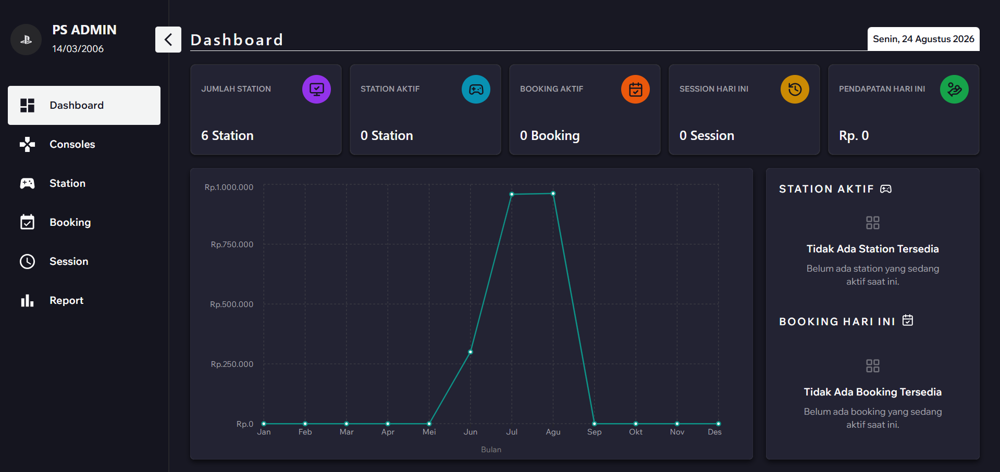
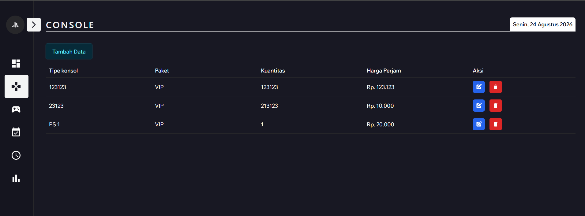
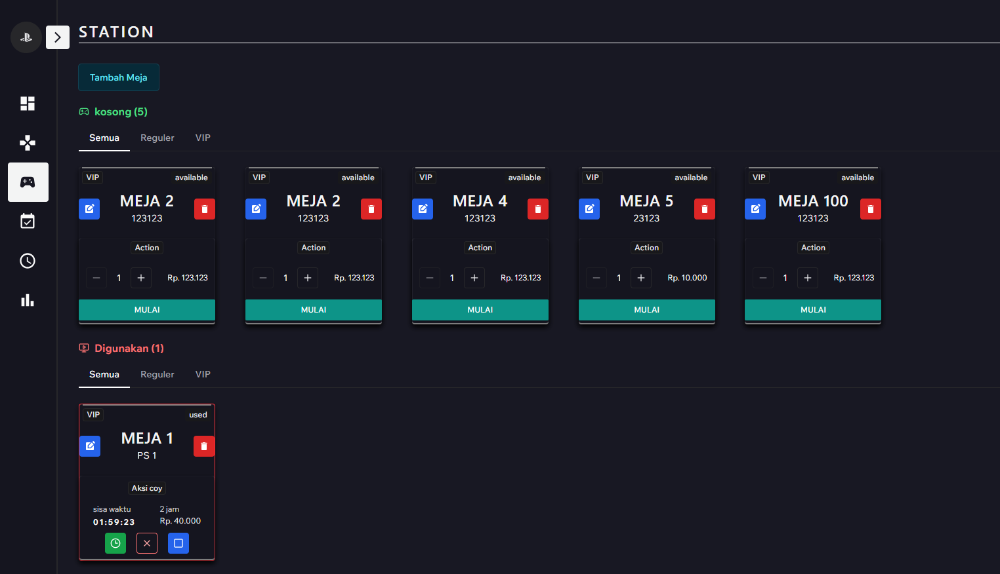
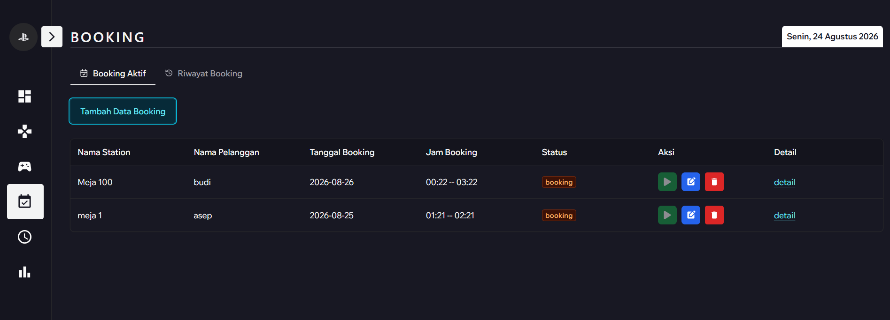
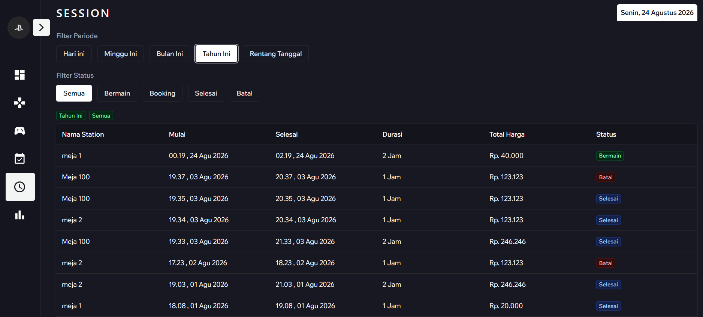
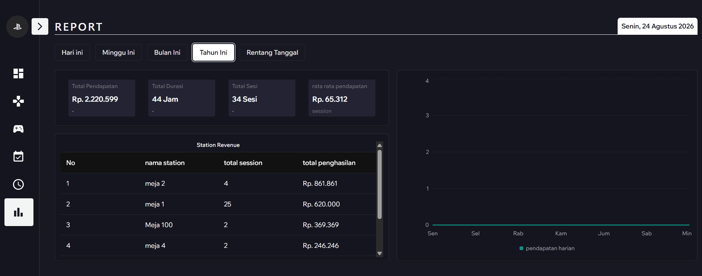

# 🎮 PlayStation Management System

<p align="center">
  <strong>Sistem Manajemen Rental PlayStation Berbasis Web</strong>
</p>

<p align="center">
  Aplikasi Full-Stack untuk membantu pengelolaan rental PlayStation, mulai dari booking, station, session bermain, billing, hingga monitoring pendapatan.
</p>

---

## 🌐 Demo

🔗 **Live Demo:** `Coming Soon`

---

## 📌 Tentang Project

**PlayStation Management System** adalah aplikasi berbasis web yang dirancang untuk membantu pengelola rental PlayStation dalam mengelola operasional rental secara lebih terstruktur dan efisien.

Aplikasi ini mencakup berbagai proses utama dalam pengelolaan rental, seperti **pengelolaan console dan station, booking pelanggan, session bermain, billing, serta monitoring dan laporan pendapatan**.

Project ini dibangun menggunakan arsitektur **Full-Stack**, dengan **React** sebagai frontend, **Node.js dan Express.js** sebagai backend, serta **PostgreSQL** sebagai database.

Sistem juga menerapkan **authentication dan authorization** untuk membatasi akses pengguna berdasarkan role serta menggunakan mekanisme **access token dan refresh token** dalam proses authentication.

Project ini dibuat sebagai bagian dari portfolio untuk menunjukkan kemampuan dalam membangun aplikasi Full-Stack, mulai dari perancangan database, pengembangan REST API, implementasi business logic, hingga pembuatan antarmuka yang responsive.

---

## ✨ Fitur

### 🔐 Authentication & Authorization

* Login dan logout pengguna
* Access token & refresh token
* Protected routes
* Role-based authorization
* HTTP-only cookies
* Session management
* Middleware untuk proteksi API

### 📊 Dashboard

* Ringkasan statistik rental
* Monitoring session yang sedang berlangsung
* Informasi pendapatan
* Statistik jumlah session
* Ringkasan aktivitas rental

### 🎮 Console & Station Management

* Mengelola data console
* Mengelola station rental
* Menentukan tipe console
* Mengatur harga berdasarkan package
* Monitoring status station
* Pengelolaan ketersediaan station

### 📅 Booking Management

* Membuat booking
* Menentukan station yang akan digunakan
* Menentukan tanggal dan waktu booking
* Membatalkan booking
* Melihat riwayat booking
* Pengelolaan status booking

### ⏱️ Session Management

* Memulai session bermain
* Mengakhiri session
* Menambahkan durasi bermain
* Monitoring session aktif secara real-time
* Menghitung waktu bermain
* Pengelolaan status session

### 💰 Billing & Revenue

* Perhitungan billing berdasarkan durasi bermain
* Perhitungan total harga
* Monitoring pendapatan
* Laporan pendapatan
* Statistik pendapatan berdasarkan periode
* Perbandingan performa pendapatan

### 📱 Responsive Design

* Tampilan utama dioptimalkan untuk desktop
* Beberapa komponen mendukung ukuran layar yang lebih kecil
* Responsive layout sedang dikembangkan untuk meningkatkan pengalaman penggunaan pada perangkat mobile

---

## 🛠️ Teknologi yang Digunakan

### Frontend

<p>
  
  
  
  
</p>

* React
* Vite
* Tailwind CSS
* Chakra UI
* Axios
* React Router
* Zustand
* Motion

### Backend

<p>
  
  
</p>

* Node.js
* Express.js
* REST API
* JWT Authentication
* Middleware
* Cookie-based Authentication

### Database

<p>
  
</p>

* PostgreSQL
* SQL
* Relational Database
* Database Relationships
* Database Transactions
* SQL Queries
* Query Optimization
* `timestamptz` untuk penyimpanan timestamp dengan timezone

---

## 🏗️ Arsitektur Aplikasi

```text
┌───────────────────────────────┐
│           Frontend            │
│                               │
│ React + Vite                  │
│ Tailwind CSS + Chakra UI      │
│ Zustand + Axios               │
└───────────────┬───────────────┘
                │
                │ HTTP / REST API
                ▼
┌───────────────────────────────┐
│            Backend            │
│                               │
│ Node.js + Express.js          │
│ Authentication               │
│ Authorization + Middleware    │
│ Business Logic                │
└───────────────┬───────────────┘
                │
                │ SQL Queries
                ▼
┌───────────────────────────────┐
│          PostgreSQL           │
│                               │
│ Users                         │
│ Console                       │
│ Station                       │
│ Booking                       │
│ Session                       │
│ Revenue & Reports             │
└───────────────────────────────┘
```

---

## 📂 Struktur Project

```text
playstation-management-system/
│
├── frontend/
│   ├── src/
│   │   ├── api/
│   │   ├── components/
│   │   ├── hooks/
│   │   ├── layouts/
│   │   ├── pages/
│   │   ├── stores/
│   │   ├── utils/
│   │   ├── App.jsx
│   │   └── main.jsx
│   ├── public/
│   ├── package.json
│   └── vite.config.js
│
├── backend/
│   ├── src/
│   │   ├── controllers/
│   │   ├── middleware/
│   │   ├── routes/
│   │   ├── services/
│   │   ├── utils/
│   │   ├── config/
│   │   └── server.js
│   ├── migrations/
│   ├── package.json
│   └── .env
├── .gitignore
└── README.md
```

---

## 🗄️ Database Setup

Project ini menggunakan **PostgreSQL** sebagai database.

Database production tidak disertakan dalam repository. Sebagai gantinya, struktur database dapat dibuat menggunakan migration yang tersedia di dalam project.

### 1. Buat Database

Buat database PostgreSQL baru:

```sql
CREATE DATABASE playstation_admin;
```

### 2. Konfigurasi Environment Variables

Buat file `.env` di dalam folder `backend`:

```env
PORT=3000

DB_HOST=localhost
DB_PORT=5432
DB_USER=postgres
DB_PASSWORD=your_database_password
DB_NAME=playstation_admin

ACCESS_TOKEN=your_access_token_secret
REFRESH_TOKEN=your_refresh_token_secret
```

Buat file `.env` di dalam folder `frontend`:

```env
VITE_BASE_API =
```

### 3. Jalankan Migration

Jalankan seluruh migration yang tersedia pada project:

```bash
npm run migrate
```

Setelah migration selesai, database akan memiliki struktur tabel yang dibutuhkan oleh aplikasi.

---

## 🔑 Environment Variables

| Variable        | Deskripsi                        |
| --------------- | -------------------------------- |
| `PORT`          | Port yang digunakan oleh backend |
| `DB_HOST`       | Host PostgreSQL                  |
| `DB_PORT`       | Port PostgreSQL                  |
| `DB_USER`       | Username PostgreSQL              |
| `DB_PASSWORD`   | Password PostgreSQL              |
| `DB_NAME`       | Nama database aplikasi           |
| `ACCESS_TOKEN`  | Secret untuk access token        |
| `REFRESH_TOKEN` | Secret untuk refresh token       |

Disarankan untuk menyediakan `.env.example`:

```env backend
PORT=3000

DB_HOST=localhost
DB_PORT=5432
DB_USER=postgres
DB_PASSWORD=your_database_password
DB_NAME=playstation_admin

ACCESS_TOKEN=your_access_token_secret
REFRESH_TOKEN=your_refresh_token_secret
```

```env frontend
VITE_BASE_API = 3000
```
---

## 🚀 Instalasi

### 1. Clone Repository

```bash
git clone https://github.com/fykri/playstation_admin.git

cd playstation_admin
```

### 2. Install Dependency Frontend

```bash
cd frontend
npm install
```

### 3. Install Dependency Backend

Buka terminal baru atau kembali ke root project:

```bash
cd backend
npm install
```

### 4. Konfigurasi Environment

Buat file `.env` di dalam folder `backend` berdasarkan `.env.example`.

```bash
cp .env.example .env
```

Kemudian sesuaikan konfigurasi database dan secret authentication.

### 5. Buat Database

Pastikan PostgreSQL sudah berjalan, kemudian buat database:

```sql
CREATE DATABASE playstation_admin;
```

### 6. Jalankan Migration

```bash
npm run migrate
```

### 7. Jalankan Backend

```bash
npm run dev
```

Backend akan berjalan pada:

```text
http://localhost:3000
```

### 8. Jalankan Frontend

Buka terminal baru:

```bash
cd frontend
npm run dev
```

Frontend dapat diakses melalui:

```text
http://localhost:5173
```

---

## 📸 Screenshot

### Dashboard



### Console



### Station



### Booking



### Session



### Report



---

## 🎯 Hal yang Saya Pelajari

Melalui project ini, saya mempraktikkan dan mengimplementasikan:

* Membangun aplikasi Full-Stack dari frontend hingga backend
* Mendesain relational database PostgreSQL
* Membuat dan mengelola REST API
* Mengimplementasikan authentication dan authorization
* Menggunakan access token dan refresh token
* Melindungi API menggunakan middleware
* Mengelola state aplikasi menggunakan Zustand
* Menghubungkan frontend dengan REST API menggunakan Axios
* Membuat SQL query untuk kebutuhan laporan dan analytics
* Mengelola timestamp menggunakan timezone
* Mengimplementasikan business logic untuk booking dan session
* Mengelola perhitungan billing berdasarkan durasi bermain

---

## 🔒 Keamanan

Beberapa praktik keamanan yang diterapkan dalam aplikasi:

* HTTP-only cookies untuk refresh token
* Protected API endpoints
* JWT-based authentication
* Role-based authorization
* Environment variables untuk menyimpan credential
* Input validation
* Konfigurasi CORS
* Pemisahan frontend dan backend

> Credential production, database password, API key, JWT secret, dan data pengguna tidak disertakan dalam repository.

---

## 📈 Pengembangan Selanjutnya

* [ ] Menambahkan automated testing
* [ ] Menambahkan dokumentasi API menggunakan Swagger
* [ ] Menambahkan Docker
* [ ] Meningkatkan monitoring dan logging
* [ ] Menambahkan analytics yang lebih lengkap
* [ ] Meningkatkan accessibility
* [ ] Menambahkan CI/CD pipeline
* [ ] Menyempurnakan responsive design untuk perangkat mobile

---

## 👨‍💻 Tentang Saya

### Dzul Fikri Yunus

**Lulusan Teknik Informatika | Full-Stack Developer**

Saya tertarik dalam membangun aplikasi web dan menyelesaikan permasalahan nyata melalui teknologi.

Saya memiliki ketertarikan pada pengembangan aplikasi dari sisi frontend hingga backend, termasuk pembuatan REST API, pengelolaan database, authentication, dan pengembangan antarmuka yang responsive.

### 💻 Bidang yang Saya Minati

* Frontend Development
* Backend Development
* Full-Stack Development
* REST API
* Database Design
* Authentication & Authorization
* Web Application Development

---

<p align="center">
  ⭐ Jika project ini menarik, jangan lupa berikan star!
</p>
